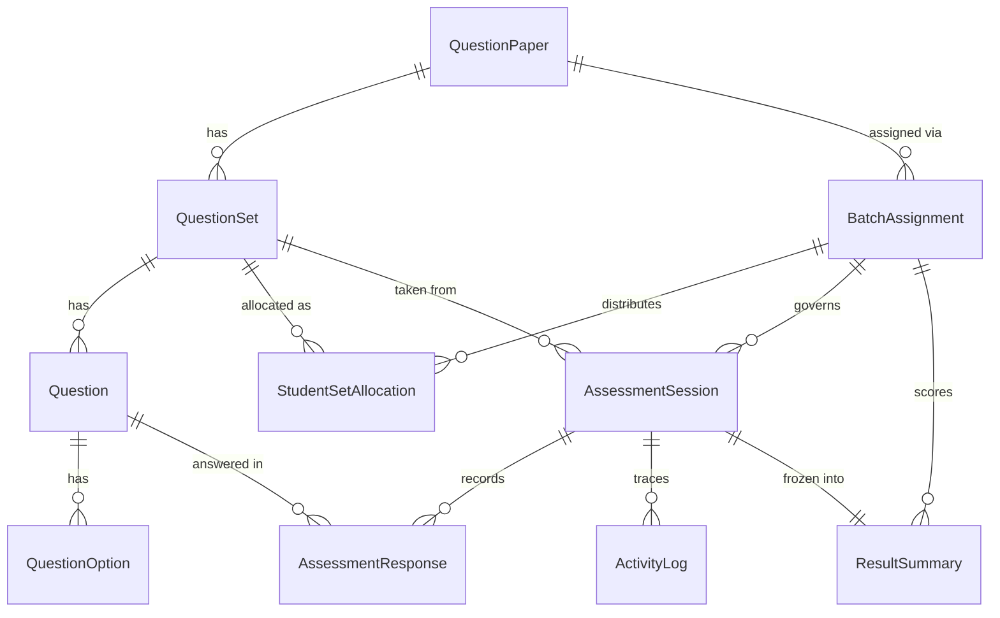

# assessment-service — Data Model & API Contract

**Status:** Frozen for Phase 1+ implementation
**Task:** [LIVETRACKER2_V1.md](../LIVETRACKER2_V1.md) Task 0.2
**Related:** [ADR 001 — Timer Architecture](adr/001-assessment-timer-architecture.md), [Timer Model Q&A & Deferred Edge Cases](assessment-service-timer-edge-cases.md), [Retake / Re-Attempt Q&A & Deferred Edge Cases](assessment-service-retake-edge-cases.md), [Operations, SLA & Monitoring](assessment-service-operations.md), [Exam-Day Runbook](runbooks/assessment-exam-day.md), [Load & Performance Test Results](assessment-service-load-test-results.md), [Chaos & Failure Injection Test Results](assessment-service-chaos-test-results.md)

This is the frozen contract every later phase implements against. Task 12.1's IDOR audit uses this document — not an ad hoc re-scan of the codebase — as its canonical endpoint checklist.

---

## Design Decisions

These are settled here, in Phase 0, precisely because leaving them for a later task to improvise would create ambiguity right at the point of implementation. Each is referenced by name from the task that consumes it.

1. **Multi-select MCQ scoring policy:** exact-match required for full marks, zero credit otherwise. No proportional partial credit in V1. (Consumed by Task 5.2.)
2. **`ends_at` vs `ended_at` naming:** `AssessmentSession.ends_at` is the enforced *deadline* — set once at session start, changed only by an explicit admin `extend/` action. `ResultSummary.ended_at` is when the session *actually* finished (submit/auto-submit timestamp). Same root word, different meaning — do not conflate them.
3. **Retake/re-attempt policy:** out of scope for V1. One session per student per `BatchAssignment`, no reset/re-issue mechanism. An admin needing to give a student another attempt creates a new `BatchAssignment`.
4. **Pass/fail cutoff location:** lives on `BatchAssignment.pass_cutoff_percentage` (default 40%, admin-editable per assignment), not on `QuestionPaper` — a paper can be reused across assignments with different pass bars, so the bar belongs to the graded event, not the content.
5. **Malpractice-flagging thresholds:** fixed global constants for V1 (not per-institution configurable, to avoid building a tuning UI nobody asked for):
   - Tab-switch count > 5
   - Fullscreen-exit count > 3
   - Average time-per-answered-question < 3 seconds (also reused as Task 12.2's bot-defense cadence signal — one threshold, not two independently-invented ones)

   Any one crossed → `ResultSummary.malpractice_flag = True`, with the specific tripped threshold name(s) appended to `ResultSummary.malpractice_reasons` so an admin sees *why*, not just *that*.

   **What this does and does not guarantee (Task 12.2):** `malpractice_flag`/`malpractice_reasons` are a *signal for human review*, surfaced to the admin via the Results module (Task 7.x) so a person can look at the specific session's activity log and make a judgment call. They are **not** a determination that cheating occurred, and the product must never present them as one. A tripped threshold can have an innocent explanation (a genuine multi-monitor workflow the fullscreen check misreads, a fast student who happens to average under 3s/question, a flaky browser firing spurious blur events) exactly as readily as it can indicate real misconduct — the system has no way to distinguish those cases, and doesn't claim to. Institutions using this platform must review flagged sessions themselves before taking any action against a student; nothing in this service is a substitute for that review, and no admin-facing text, export, or API response should ever describe a flagged session as "cheating" or "confirmed" — only as "flagged for review."
6. **Internal-only endpoints:** none identified for V1 — assessment-service has no inbound service-to-service callers yet (it only calls *outbound* to `user-service` for roster data). The `/api/assessments/internal/` Nginx block (Task 1.4) is still reserved per the platform convention (used today by `auth`/`notifications`/`analytics`) in case a future phase adds one, but it starts as a blanket `404` with nothing behind it.

---

## Data Model

All primary keys are `UUIDField(default=uuid.uuid4)`. All `institution_id`/`student_id`/`batch_id` fields are bare UUIDs copied from JWT claims or the `user-service` roster snapshot — no cross-service foreign key, matching the isolation convention already established in `practice-service`/`user-service`.



### QuestionPaper — Task 2.1
| Field | Type | Notes |
|---|---|---|
| `id` | UUID | PK |
| `institution_id` | UUID | isolation filter on every queryset |
| `title` | string | |
| `description` | text | |
| `created_by` | UUID | admin user_id |
| `created_at` / `updated_at` | timestamp | |

**Immutability:** becomes read-only the instant it has ≥1 `BatchAssignment` in `SCHEDULED`/`LIVE`/`CLOSED` (Task 2.2 stub → Task 3.2 real check). Admins wanting a changed version duplicate the paper.

**Ownership restriction (added 2026-08-17):** only the creating admin (`created_by`) or a `super_admin` may open, edit, delete, or assign a paper — enforced server-side via `_require_paper_owner` on every paper/set/question/option mutation and detail-read endpoint, returning `403` for any other admin. Every admin can still *see* every paper in the institution's list (`GET /api/assessments/admin/papers/`); non-owned papers just render locked/view-only in the UI. This is a faculty-privacy control, not an institution-isolation one — `institution_id` scoping is unchanged and unrelated.

**Response-only enrichment (not model fields, added 2026-08-17):** `GET /api/assessments/admin/papers/` additionally returns `created_by_name` and `created_by_email` per row, resolved live from auth-service via `core/auth_service_client.py` (batched, one call per page) and best-effort — a resolution failure leaves both as `""`, it never fails the papers list itself. See [assessment-service-operations.md](assessment-service-operations.md)'s "Known Incident" section for the timeout tuning this call is subject to.

### QuestionSet — Task 2.1
| Field | Type | Notes |
|---|---|---|
| `id` | UUID | PK |
| `paper` | FK → QuestionPaper | |
| `label` | string | e.g. "Set A" — unique with `paper` |
| `order` | int | |

Sets within a paper are meant to be equivalent alternates for anti-cheating distribution (AT7), not different-difficulty variants — Task 2.2 warns (non-blocking) if their total marks diverge, and Task 7.1/8.1 compare students on different sets by percentage, never raw score, precisely because they *can* diverge.

### Question — Task 2.1
| Field | Type | Notes |
|---|---|---|
| `id` | UUID | PK |
| `set` | FK → QuestionSet | |
| `question_number` | int | auto-increment per set (`Max()` aggregate, mirrors `practice-service`) |
| `question_content_type` | enum | `text` / `image` / `both` |
| `question_text` | text | |
| `question_image_key` | string | MinIO/R2 object key |
| `question_image_size_bytes` | int | |
| `question_type` | enum | `mcq` only in V1 |
| `mcq_type` | enum | `single` / `multiple` |
| `marks` | int | |

### QuestionOption — Task 2.1
| Field | Type | Notes |
|---|---|---|
| `id` | UUID | PK |
| `question` | FK → Question | |
| `label` | string | |
| `content_type` | enum | `text` / `image` |
| `text` | text | |
| `image_key` | string | |
| `is_correct` | bool | |
| `order` | int | |

Validation (Task 2.2): single-choice → exactly one `is_correct`; multiple-choice → at least one; every question ≥2 options.

### BatchAssignment — Task 3.1
| Field | Type | Notes |
|---|---|---|
| `id` | UUID | PK |
| `paper` | FK → QuestionPaper | |
| `batch_id` | UUID | from `user-service`, no cross-service FK |
| `institution_id` | UUID | |
| `global_start_time` / `global_expire_time` | timestamp | admin-configured |
| `exam_duration_minutes` | int | |
| `pass_cutoff_percentage` | int | default 40, admin-editable per assignment (Decision #4) |
| `status` | enum | `SCHEDULED` / `LIVE` / `CLOSED` — see ADR 001 |
| `created_by` | UUID | |
| `departments` | JSON list of strings | added 2026-08-17. Empty (default) = every department in the batch, matching pre-existing behavior. Non-empty = roster is filtered case-insensitively to just those departments at snapshot time (`snapshot_roster_and_allocate`) — raises if the filter would leave a first-ever snapshot with zero students against a non-empty source roster, so an assignment can never be silently created with nobody in it. |

### StudentSetAllocation — Task 3.1
| Field | Type | Notes |
|---|---|---|
| `id` | UUID | PK |
| `assignment` | FK → BatchAssignment | |
| `student_id` | UUID | |
| `set` | FK → QuestionSet | |
| `allocated_at` | timestamp | |

`unique_together = (assignment, student_id)`. Distribution: `hash(student_id + assignment_id) % set_count` — deterministic (idempotent re-run) but unpredictable (closes AT7). Roster snapshotted from `user-service` at assignment-creation time; the exam-taking path never calls `user-service` live.

### AssessmentSession — Task 4.1
| Field | Type | Notes |
|---|---|---|
| `id` | UUID | PK |
| `assignment` | FK → BatchAssignment | |
| `student_id` | UUID | |
| `set` | FK → QuestionSet | which set this student was allocated |
| `started_at` | timestamp | |
| `ends_at` | timestamp | computed once — see ADR 001, Decision #2 |
| `status` | enum | `NOT_STARTED` / `IN_PROGRESS` / `SUBMITTED` / `AUTO_SUBMITTED` / `EXPIRED_UNSTARTED` |

Index: `(status, ends_at)` — required by the beat sweep (ADR 001) and Task 11.1's audit.

### ResultSummary — Task 4.1
| Field | Type | Notes |
|---|---|---|
| `id` | UUID | PK |
| `session` | FK → AssessmentSession | resolves `result_id` → session for Task 7.2's responses/logs endpoints |
| `assignment` | FK → BatchAssignment | |
| `student_id` | UUID | |
| `institution_id` | UUID | |
| `started_at` | timestamp | copied from session |
| `ended_at` | timestamp | actual finish time — Decision #2 |
| `duration_seconds` | int | |
| `score` | int | |
| `total_marks` | int | sum of the *student's own set's* question marks — can differ across students on different sets (Decision above) |
| `status` | enum | mirrors session's terminal status |
| `malpractice_flag` | bool | |
| `malpractice_reasons` | JSON list | which threshold(s) tripped — Decision #5 |

Denormalized on purpose (Task 0.2 Optimization Requirement): written once at submit/auto-submit time, never recomputed live from raw responses on read — this is what makes Results/Analytics/Dashboard fast at thousands-of-students scale.

### AssessmentResponse — Task 5.2
| Field | Type | Notes |
|---|---|---|
| `id` | UUID | PK |
| `session` | FK → AssessmentSession | |
| `question` | FK → Question | |
| `selected_option_ids` | JSON | list of `QuestionOption.id` |
| `is_correct` | bool | |
| `marks_awarded` | int | |
| `answered_at` | timestamp | |

`unique_together = (session, question)` — an autosave is an upsert, not an insert, so replays are idempotent by construction (closes AT4).

### ActivityLog — Task 6.2
| Field | Type | Notes |
|---|---|---|
| `id` | UUID | PK |
| `session` | FK → AssessmentSession | |
| `event_type` | enum | `tab_switch` / `window_blur` / `fullscreen_exit` / `copy` / `paste` / `contextmenu` |
| `occurred_at` | timestamp | |
| `metadata` | JSON | |

### FailedJob — Task 13.1

**Added post-Phase-0, not in the original Task 0.2 draft** — found missing during a Phase 15 doc audit and added here to close the gap, per this document's own consistency rule.

| Field | Type | Notes |
|---|---|---|
| `id` | UUID | PK |
| `task_name` | string | indexed |
| `task_id` | string | Celery's own task id, blank if not applicable |
| `args` / `kwargs` | JSON | the failed task's original call arguments |
| `error` | text | |
| `traceback` | text | |
| `attempts` | int | |
| `created_at` | timestamp | |
| `resolved_at` | timestamp, nullable | set manually once an on-call engineer confirms the underlying cause is fixed |

**Not institution-scoped, deliberately** — the two periodic sweep tasks operate across every institution in one pass, so a failure here is an ops-team concern, not a tenant-facing one. Not exposed through the per-institution admin API; queried directly (Django shell or a future ops tool) per Task 13.2's "operational dashboard (or documented queries)" allowance — see [the exam-day runbook](runbooks/assessment-exam-day.md) §5 for the exact query.

---

## API Contract

### Admin — Question Papers (Task 2.2)

As-implemented — flatter than originally drafted, matching `practice-service`'s actual convention (nesting only for list/create, flat detail routes for the leaf resources) rather than the deeper `papers/<id>/sets/<id>/questions/<id>/options/` nesting first sketched in Phase 0:
```
GET/POST                /api/assessments/admin/papers/                                          list (paginated) / create
GET/PATCH/DELETE         /api/assessments/admin/papers/<uuid:pk>/                                 detail (+ sets) / update / delete
POST                     /api/assessments/admin/papers/<uuid:pk>/sets/                             create a set under this paper
GET/PATCH/DELETE         /api/assessments/admin/sets/<uuid:pk>/                                    detail (+ questions) / update / delete
POST                     /api/assessments/admin/sets/<uuid:pk>/questions/                           create a question under this set
POST                     /api/assessments/admin/sets/<uuid:pk>/image-presign/                       presigned upload for a question's image *before the question exists yet*
GET/PATCH/DELETE         /api/assessments/admin/questions/<uuid:pk>/                                detail (+ options) / update / delete
GET/POST                 /api/assessments/admin/questions/<uuid:pk>/options/                        list / create an option
PATCH/DELETE             /api/assessments/admin/questions/<uuid:pk>/options/<uuid:option_pk>/       update / delete an option
POST                     /api/assessments/admin/questions/<uuid:pk>/image-presign/                  presigned upload for the question's own image
POST                     /api/assessments/admin/questions/<uuid:pk>/options/<uuid:option_pk>/image-presign/  presigned upload for an option's image
```
`admin/sets/<pk>/image-presign/` (added 2026-08-14): scoped to the QuestionSet rather than a Question, since `question_content_type='image'`/`'both'` couldn't otherwise ever be used on a question's first save — the question-level presign endpoint needs a question id, but `'both'` can't be saved without an image already attached, and there was no way to get an image attached before the question exists. `AdminSetQuestionsView.post` (question create) now runs the same verify/quarantine-scan + paper image-quota gate on `question_image_key` that `AdminQuestionDetailView.patch` already applied on every later image change, so an image attached at creation time is checked exactly once, not skipped.
All PATCH/DELETE on a locked (assigned) paper, its sets, questions, or options → `403` "This paper is assigned and locked." Publish/unpublish was removed from the admin workflow (2026-08-14) — `POST /api/assessments/admin/assignments/` is now the sole readiness gate: it runs the full readiness check (every question in every set: has content, ≥2 options, exactly the right correct-answer count, plus equal question counts/marks across sets) and rejects with `400` and the specific reasons if any check fails.

### Admin — Batch Assignment & Timer Control (Task 3.2)
```
GET     /api/assessments/admin/assignments/                                      list (paginated, filterable by paper_id) — missing from this doc until a Phase 15 audit found it, added here to close the gap
POST    /api/assessments/admin/assignments/                                      create + distribute (Task 3.1)
GET     /api/assessments/admin/assignments/<id>/                                 detail — same as above, added during the Phase 15 audit
PATCH   /api/assessments/admin/assignments/<id>/start/                           SCHEDULED → LIVE
PATCH   /api/assessments/admin/assignments/<id>/close/                           LIVE → CLOSED (+ cascade, Task 4.1)
GET     /api/assessments/admin/assignments/<id>/status/                          {status, student_count_total, student_count_completed*}
PATCH   /api/assessments/admin/assignments/<id>/sessions/<session_id>/extend/    patch one session's ends_at (Task 4.1)
POST    /api/assessments/admin/assignments/<id>/resync-roster/                   additive, idempotent
```
\* `student_count_completed` only appears once Task 5.1 lands (sessions don't exist before Phase 4/5) — earlier callers get `student_count_total` only.

`POST /api/assessments/admin/assignments/` is subject to the same ownership restriction as the paper itself (added 2026-08-17): assigning a paper you didn't create returns `403` unless you're a `super_admin`, via the same `_require_paper_owner` check. `departments` (see BatchAssignment above) is accepted in this create payload.

### Admin — Results, Analytics, Dashboard (Task 7.x / 8.x / 9.x)
```
GET  /api/assessments/admin/assignments/<id>/results/              paginated, filterable, percentage-sortable
GET  /api/assessments/admin/results/<result_id>/responses/         via ResultSummary.session
GET  /api/assessments/admin/results/<result_id>/logs/              via ResultSummary.session, incl. malpractice_reasons
GET  /api/assessments/admin/assignments/<id>/results/export/       streaming CSV, UTF-8 BOM
GET  /api/assessments/admin/assignments/<id>/analytics/            percentage-normalized across sets
GET  /api/assessments/admin/assignments/<id>/analytics/export/
GET  /api/assessments/admin/assignments/<id>/dashboard/            Redis-cached KPI rollup
GET  /api/assessments/admin/assignments/<id>/dashboard/export/
```

### Student (Task 5.1 / 5.2 / 4.2 / 10.1)
```
GET   /api/assessments/student/assignments/                              gated by StudentSetAllocation + assignment.status
POST  /api/assessments/student/assignments/<id>/start-session/           idempotent create-or-resume
GET   /api/assessments/student/server-time/                              {now, ends_at?}
GET   /api/assessments/student/sessions/<id>/questions/                  session's own set's questions (Task 5.4) — never includes is_correct; added post-Phase-0, not in the original Task 0.2 draft
PUT   /api/assessments/student/sessions/<id>/questions/<qid>/answer/     idempotent upsert
POST  /api/assessments/student/sessions/<id>/submit/                     conditional UPDATE...WHERE status='IN_PROGRESS'
POST  /api/assessments/student/sessions/<id>/activity-logs/              bulk-insert batch of events (Task 6.1 client batching → Task 6.2), rate-limited per session
GET   /api/assessments/student/results/                                  own ResultSummary rows only, JWT-scoped
```

### Health
```
GET  /api/assessments/health/
```
`GET /api/assessments/ready/` was documented here but never actually implemented — found during a Phase 15 audit (live-tested: returns `404`, only `health/` works, `200`). nginx has a location block for it, but no Django route exists behind it. Not a regression specific to this service: no other service in the platform implements a working `ready/` endpoint either, so this was a stale claim carried over from an early draft, not a missing feature that once worked.

### Internal
```
/api/assessments/internal/    blocked (404) — reserved, unused in V1 (Decision #6)
```

---

## Outbound Calls

assessment-service calls `user-service`'s `GET /api/users/batches/<batch_id>/students/` exactly once, at assignment-creation time (Task 3.1), to snapshot the roster into `StudentSetAllocation`. No other service-to-service call exists in V1. This call is wrapped in a circuit breaker/timeout (Task 13.1) — a roster-fetch failure fails that specific admin action cleanly, never degrades the exam-taking path (which never calls `user-service` live).

---

## Consistency Note

Every endpoint above maps to a model defined in this document. Task 12.1's IDOR audit checks off against this list directly. If an implementation needs an endpoint not listed here, update this document first — it is the frozen contract, not a suggestion.

**Audit (2026-08-13, Phase 15):** checked this document line-by-line against the live `urls.py`/`models.py`, not assumed current. Found and fixed 4 real gaps where the two had drifted apart: the `FailedJob` model (Task 13.1) was entirely undocumented; two real, working endpoints (`GET .../admin/assignments/` list, `GET .../admin/assignments/<id>/` detail) were missing from the contract; and `GET .../ready/` was documented as real but doesn't exist (confirmed live: `404`). All four fixed in place above. No other drift found in a full pass of every model and every listed endpoint.
